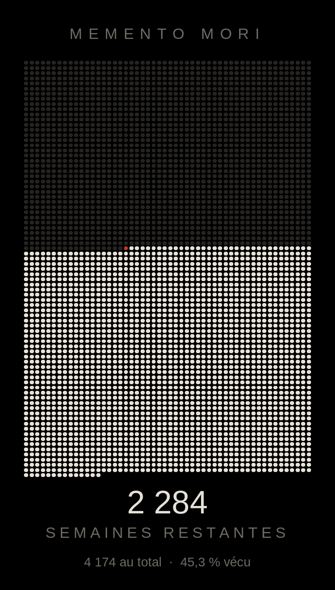

# Memento Mori

Widget d'écran d'accueil Android qui affiche la vie en semaines. Une case par semaine,
52 par ligne, donc une ligne par année. Les semaines révolues sont pleines, la semaine en
cours est rouge, celles qui restent sont éteintes.

<p align="center">
  
</p>

Sous la grille, le nombre de semaines qui restent, le total et la part déjà vécue.

## Installation

Avec [Obtainium](https://github.com/ImranR98/Obtainium), ajouter une application depuis
l'URL de ce dépôt : les mises à jour suivent les releases. Sinon, télécharger l'APK de la
[dernière release](https://github.com/kvngch/memento-mori/releases/latest) et l'installer.

L'application n'apparaît pas dans le tiroir d'applications, seulement dans le sélecteur de
widgets. Posez le widget, étirez-le à toute la grille de l'écran d'accueil : un écran de
réglage s'ouvre et demande la date de naissance et l'âge de fin de vie estimé, en affichant
la date de fin correspondante et le nombre de semaines que cela représente. Un appui sur le
widget rouvre cet écran.

## Fonctionnement

Le manifeste ne déclare aucune permission et l'application n'embarque pas de dépendance.
La date de naissance et l'âge de fin restent dans ses préférences. L'APK fait 620 Ko et
demande Android 8.0.

Le widget est un bitmap unique, dessiné au `Canvas` et posé dans un seul `ImageView` :
une grille de 4174 points ne peut pas être faite de `RemoteViews`. Le système plafonne la
mémoire d'un widget à six octets par pixel d'écran, donc le bitmap ne dépasse jamais les
dimensions de l'écran. Comme un bitmap ne dit rien à un lecteur d'écran, le décompte est
répété en toutes lettres dans la description de contenu. Le widget se redessine une fois
par jour.

Le total est calculé en semaines réelles entre la naissance et l'âge de fin, soit 4174
semaines pour 80 ans, réparties sur 81 lignes de 52. Une ligne ne vaut donc pas exactement
une année calendaire, 52 semaines faisant 364 jours.

Kotlin, `minSdk` 26, ni AndroidX ni Compose. Trois fichiers : `Life.kt` pour le calcul,
`MementoWidget.kt` pour le rendu, `ConfigActivity.kt` pour les réglages.

## Construire

```bash
./gradlew testDebugUnitTest assembleDebug
```

Pour publier : incrémenter `versionCode` et `versionName` dans `app/build.gradle.kts`,
commiter, puis pousser un tag `vX.Y.Z`. La CI construit l'APK signé et le publie en release
avec son empreinte SHA-256.
